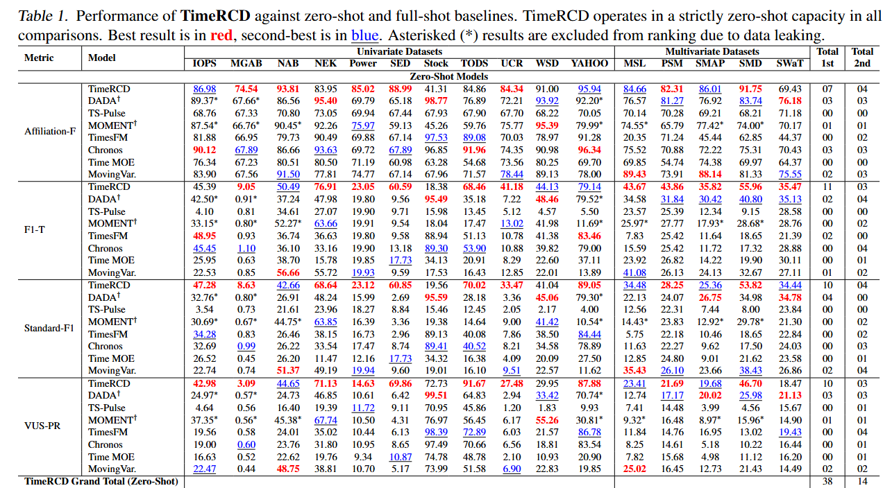

<div align="center">

# Time-RCD

_Towards Foundation Models for Zero-Shot Time Series Anomaly Detection: Leveraging Synthetic Data and Relative Context Discrepancy_

[](https://arxiv.org/abs/2509.21190)
[](https://huggingface.co/spaces/thu-sail-lab/Time_RCD)
[](https://mp.weixin.qq.com/s/79M3jsEhMKBzbNYpROOBCw)

</div>

<p align="center">
    📰&nbsp;<a href="#-news">News</a>
    | 🔍&nbsp;<a href="#-about">About</a>
    | 🚀&nbsp;<a href="#-quick-start">Quick Start</a>
    | 📊&nbsp;<a href="#-evaluation">Evaluation</a>
    | 📁&nbsp;<a href="#-project-structure">Project Structure</a>
    | 🔗&nbsp;<a href="#-citation">Citation</a>
</p>

## 📰 News

- **2026.05:** Time-RCD has been accepted by **ICML 2026**. We also release the [pre-trained dataset generation code and hyperparameters](https://github.com/thu-sail-lab/TSAD_dataset_gen_public).

- **2026.04:** With a new dataset and new checkpoints, Time-RCD achieves better results. The univariate setting improves VUS-PR by an **absolute 6.7 points**, and the multivariate setting improves VUS-PR by an **absolute 4.5 points**.

## 🔍 About

This repository contains the implementation of **Time-RCD** for time series anomaly detection, integrated with the TSB-AD (Time Series Benchmark for Anomaly Detection) datasets.

🐘 On the [TSB-AD benchmark](https://thedatumorg.github.io/TSB-AD/), Time-RCD achieves a **Univariate VUS-PR of 0.52** and a **Multivariate VUS-PR of 0.32**.


**[🌟 Live Demo on Hugging Face Spaces](https://huggingface.co/spaces/thu-sail-lab/Time_RCD)** - Experience Time-RCD in action with our interactive demo!

<div align="center">

</div>

## 🚀 Quick Start

### Prerequisites

- Python 3.10
- conda (recommended for environment management)
- Git

### Installation

#### 1. Create and Activate Conda Environment

```bash
conda create -n Time-RCD python=3.10
conda activate Time-RCD
```

#### 2. Download the Repository

```bash
git clone https://github.com/thu-sail-lab/Time-RCD.git
cd Time-RCD
```

#### 3. Download TSB-AD Datasets

Create the datasets directory and download the TSB-AD-U (univariate) and TSB-AD-M (multivariate) datasets:

```bash
mkdir -p "datasets" \
  && wget -O "datasets/TSB-AD-U.zip" "https://www.thedatum.org/datasets/TSB-AD-U.zip" \
  && wget -O "datasets/TSB-AD-M.zip" "https://www.thedatum.org/datasets/TSB-AD-M.zip" \
  && cd datasets \
  && unzip TSB-AD-U.zip && rm TSB-AD-U.zip \
  && unzip TSB-AD-M.zip && rm TSB-AD-M.zip \
  && cd ..
```

#### 4. Install Python Dependencies

**Option A: Fast Install (using uv)**

```bash
pip install uv
uv pip install jaxtyping einops pandas numpy scikit-learn transformers torch torchvision statsmodels matplotlib seaborn -U "huggingface_hub[cli]"
```

**Option B: Normal Install**

```bash
pip install jaxtyping einops pandas numpy scikit-learn transformers torch torchvision statsmodels matplotlib seaborn -U "huggingface_hub[cli]"
```

#### 5. Download Pre-trained Checkpoints

Download the pre-trained model checkpoints from Hugging Face:

```bash
huggingface-cli download thu-sail-lab/Time-RCD --include "best_model/pretrain_checkpoint_best_uni.pth" --local-dir .
huggingface-cli download thu-sail-lab/Time-RCD --include "best_model/pretrain_checkpoint_best_multi.pth" --local-dir .
```

For servers in China, use the mirror endpoint:

```bash
HF_ENDPOINT=https://hf-mirror.com \
hf download thu-sail-lab/Time-RCD --include "best_model/pretrain_checkpoint_best_uni.pth" --local-dir .
hf download thu-sail-lab/Time-RCD --include "best_model/pretrain_checkpoint_best_multi.pth" --local-dir 
```

## 🏋️ Training

Run pretraining with default single-dataset mode:

```bash
python training.py --mode single --gpus 0 --num-workers 0
```

Run multi-dataset pretraining:

```bash
python training.py --mode multi --gpus 0 --num-workers 0
```

Resume from latest checkpoint:

```bash
python training.py --mode single --gpus 0 --num-workers 0 --resume auto
```

## 📊 Evaluation

### Single Variable Time Series

To run anomaly detection on univariate time series:

```bash
python main.py
```

### Multi-Variable Time Series

To run anomaly detection on multivariate time series:

```bash
python main.py --mode multi
```

## 📁 Project Structure

```
.
├── checkpoints/          # Pre-trained model checkpoints
├── datasets/            # TSB-AD datasets (univariate and multivariate)
├── evaluation/          # Evaluation metrics and visualization tools
├── models/              # Model implementations
│   └── time_rcd/       # Time-RCD model components
├── utils/               # Utility functions
├── main.py              # Main entry point
├── model_wrapper.py     # Model wrapper for different algorithms
└── README.md            # This file
```

## 🔗 Citation

If you find this work useful, please cite our paper:

```bibtex
@misc{lan2025foundationmodelszeroshottime,
      title={Towards Foundation Models for Zero-Shot Time Series Anomaly Detection: Leveraging Synthetic Data and Relative Context Discrepancy}, 
      author={Tian Lan and Hao Duong Le and Jinbo Li and Wenjun He and Meng Wang and Chenghao Liu and Chen Zhang},
      year={2025},
      eprint={2509.21190},
      archivePrefix={arXiv},
      primaryClass={cs.LG},
      url={https://arxiv.org/abs/2509.21190}, 
}
```
